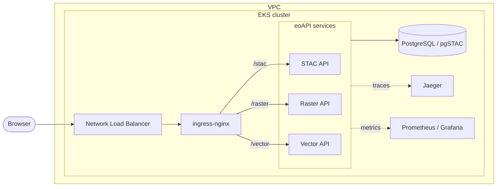

# eoAPI on AWS EKS via CDK

[](https://github.com/quetzal-hub/eoapi-eks-cdk/actions/workflows/ci.yml)
[](LICENSE)
[](https://www.python.org/)

Infrastructure-as-code deployment of the [eoAPI](https://eoapi.dev) geospatial
stack (STAC metadata, raster tiling, vector features) onto Amazon EKS, using
the AWS Cloud Development Kit (Python). CDK provisions the cluster; Helm
deploys the application and observability stack.

This is one of two implementations of the same system, built deliberately
with different tools. A companion
[**Terraform version**](https://github.com/quetzal-hub/eoapi-eks-terraform)
exists for a direct CDK-vs-Terraform comparison.

## What this deploys

| Layer | Tool | Components |
|---|---|---|
| Infrastructure | CDK | VPC, EKS cluster (Kubernetes 1.34), managed node group |
| Data | Helm | PostgreSQL via the CrunchyData Postgres operator, with [pgSTAC](https://github.com/stac-utils/pgstac) |
| Application | Helm | eoAPI services: STAC API, raster tiles (TiTiler), vector features (TiPg) |
| Ingress | Helm | ingress-nginx controller (provisions a Network Load Balancer); the eoAPI chart's ingress routes `/stac`, `/raster`, `/vector` and strips each prefix |
| Observability | Helm + kubectl | Prometheus + Grafana metrics; OpenTelemetry auto-instrumentation into Jaeger for tracing, with zero app-code changes |

## Architecture



**Design principle: CDK owns infrastructure; Helm owns the application.**
This split isn't stylistic: CDK's `add_helm_chart` runs Helm inside a
Lambda-backed custom resource, whose 15-minute execution cap and response-size
limit a slow-settling database chart cannot fit. Moving the application layer
to plain Helm is the fix, and it mirrors how production teams separate
infrastructure pipelines from app delivery. Details in
[docs/TROUBLESHOOTING.md](docs/TROUBLESHOOTING.md).

## Repository layout

```
├── app.py                  # CDK app entry point
├── eoapi_eks_cdk/          # CDK stack: VPC, EKS, node group
├── k8s/                    # Manifests applied post-provisioning
│   ├── gp3-storageclass.yaml       # Default StorageClass (EKS ships none)
│   ├── jaeger.yaml                 # Jaeger all-in-one + service
│   └── otel-instrumentation.yaml   # OTel auto-instrumentation resource
├── iam/                    # IRSA trust policy template for the EBS CSI driver
├── data/                   # Sample STAC collection + items (LA wildfires 2025)
├── docs/                   # Full deployment guide and troubleshooting log
└── tests/                  # CloudFormation template assertions
```

## Quick start

```bash
python -m venv .venv
source .venv/bin/activate   # Windows PowerShell: .venv\Scripts\Activate.ps1
pip install -r requirements.txt

cdk deploy                  # ~20 min: VPC, EKS, nodes
aws eks update-kubeconfig --region <region> --name <ClusterName output>
```

Then follow **[docs/DEPLOYMENT.md](docs/DEPLOYMENT.md)** for the application
layer: storage driver, Postgres operator, eoAPI chart, ingress, sample data,
and observability. Teardown steps (and cost warnings) are there too, as is
a [PowerShell translation guide](docs/DEPLOYMENT.md#running-on-windows-powershell)
for the handful of commands that need more than `bash` on Windows.

## Notable problems solved

This project involved real debugging, not just a happy path. Each item links
to a full write-up in [docs/TROUBLESHOOTING.md](docs/TROUBLESHOOTING.md).
Several are steps that `eksctl` (the tooling the upstream eoapi-k8s docs use)
automates; provisioning with raw CDK instead meant handling them explicitly,
which is where most of the debugging happened:

- **CDK's Helm mechanism has structural ceilings.** Lambda's 15-minute cap
  forced the CDK/Helm split described above.
- **IAM authentication ≠ Kubernetes authorization.** A valid AWS identity
  needs an explicit EKS Access Entry to act in-cluster, and
  `bootstrap_cluster_creator_admin_permissions` grants that entry to the CDK
  bootstrap role, not the human running `cdk deploy`, so `kubectl` lands
  authenticated but unauthorized.
- **An unregistered IAM OIDC provider.** A cluster's OIDC issuer exists on
  creation, but IAM won't trust it until the provider is registered
  separately, a step nothing in a plain `cdk deploy` does automatically.
- **A malformed OIDC trust policy** crash-looped the EBS CSI driver with
  `AccessDenied`; diagnosed by diffing the registered provider ARN against
  the trust policy line by line.
- **Storage isn't automatic on EKS ≥1.30.** There is no default StorageClass,
  and the EBS CSI driver is a separate add-on with its own IRSA role.
- **The eoAPI chart pins ingress to nginx/traefik.** The services serve at
  `/` and need the `/stac`, `/raster`, `/vector` prefixes stripped before
  forwarding. The chart manages the Ingress and restricts `ingress.className`
  to nginx or traefik (both strip prefixes natively), so the controller is
  ingress-nginx.
- **A Helm `--wait`/hook deadlock.** The chart's migration hook and the API
  pods' init containers wait on each other when `--wait` is used.
- **An OTel operator webhook race.** Installing the operator without
  `--wait` and immediately applying its CRD loses a race against the
  operator pod becoming ready; a plain rollout-status wait fixes it.
- **A silent OpenTelemetry port mismatch.** Traces sent as http/protobuf to
  the gRPC port (4317 instead of 4318) fail without a visible error; found by
  reading the injected environment inside a running container.

## Development

```bash
pip install -r requirements-dev.txt
pytest          # template assertions (synthesizes the stack)
ruff check .    # lint
cdk synth       # emit CloudFormation
```

CI runs lint, tests, and a full `cdk synth` on every push and pull request.

## License

[MIT](LICENSE)
